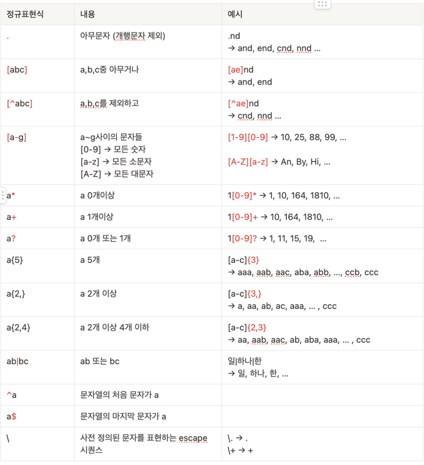

# 문자열 사용 관련

📌 자주 사용되는 정규표현식   

📌 문자열과 정수를 진법(radix)에 따라 변환하는 메서드

| 메서드 | 반환형  |  |
| --- |------| --- |
| Integer.parseInt(String s, int r) | int | r진법으로 숫자를 표현하는 문자열 s를 정수로 변환 |
| Integer.toString(int v, int r) | String | 정수 v를 r진법의 문자열로 변환 |
| Long.parseLong(String s, int r) | long | r진법으로 숫자를 표현하는 문자열 s를 정수로 변환 |
| Long.toString(long l, int r) | String | 정수l을 r진법의 문자열로 변환 |

